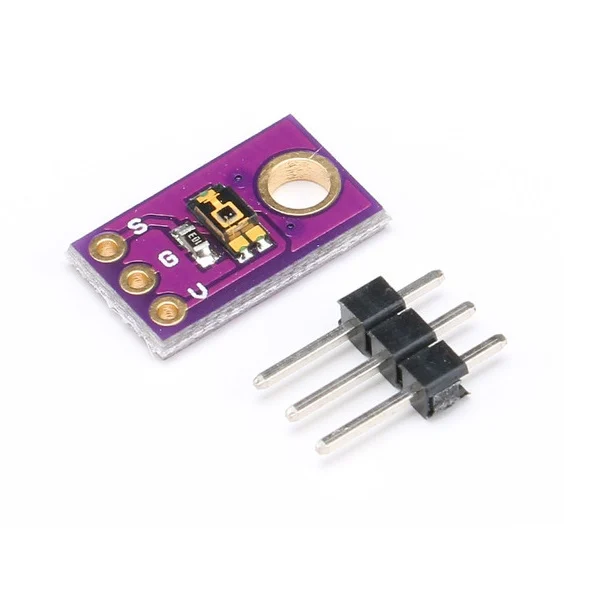

# TEMT6000 Ambient Light Sensor
Code examples for TEMT6000 Ambient Light Sensor

<picture>
  
</picture>

The TEMT6000 Ambient Light Sensor Module is a visible light to analog voltage converter for measuring the intensity of light.

Watch the implementation of this code on our [YouTube channel](https://www.youtube.com/@Roboticxps)

To get your own TEMT6000 Ambient Light Sensor, visit our online store: (Product Page)

* [TEMT6000 Ambient Light Sensor](https://roboticx.ps/product/temt6000-ambient-light-sensor-module-cjmcu/)

----

Follow us on social media:

* Facebook: https://www.facebook.com/Roboticxps
* Instagram: https://www.instagram.com/roboticx.ps
* YouTube: https://www.youtube.com/@Roboticxps
* LinkedIn: https://www.linkedin.com/company/roboticx
